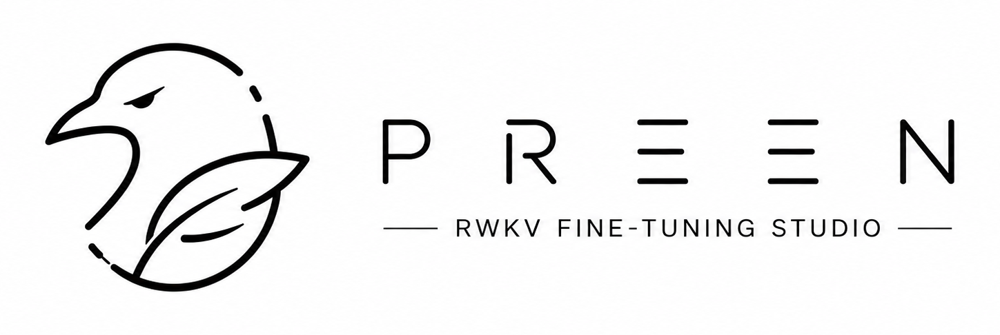

<p align="center">
  
</p>

# Preen — RWKV-7 State Tuning for Mac

> 在 Mac 上给 RWKV-7 做 state tuning 的工具。目标形态是一个 SwiftUI 应用:
> 拖入 jsonl 数据集,选模型,训练,导出一个可挂载的 state 文件。
>
> 做法是冻结模型全部权重,只训练每层 64×64 的初始状态矩阵 S₀。模型从这个状态
> 启动时,就会表现出目标行为——某种说话风格、人设或输出格式。

命令行工具 `statetuner` 是这套训练/推理引擎的直接入口,也是 SwiftUI 应用的底层。
它先于图形界面就绪,既是往后搭 UI 的地基,也是一条不依赖界面、可脚本化的兜底通道。

当前进度:核心引擎与 CLI 已就绪,`.pth` 导出与 RWKV Runner 挂载都已验证,SwiftUI 外壳待建。

- P0 技术验证:梯度穿透、收敛、泛化、ops/kernel 等价,见 [实验报告](experiments/p0_translate/实验报告.md)
- P1 产品化:训练循环、`.pth` 导出器、回归测试
- P2 命令行:train / eval / preview / chat / export 全流程打通

P1/P2 的实测数据与技术裁决汇总在 [工程实测数据](docs/工程实测数据.md)。

---

## 这是什么

RWKV-7 是线性注意力架构,每层维护一个矩阵值状态 S,随序列不断演化。
常规做法里 S 从零开始;state tuning 把 S 的初始值 S₀ 变成可训练参数,
用梯度下降找一个"虚拟前缀"等价的初始状态。模型从这个状态启动,行为就已经
偏向目标——某种说话风格,或某种任务模式——而不需要在 prompt 里反复交代。

P0 阶段验证了五件事,详见 [实验报告](experiments/p0_translate/实验报告.md):

| 命题 | 结果 |
|---|---|
| 梯度能穿透递归抵达每层 S₀ | 成立 |
| 优化器能把 10 条样本 loss 压到接近零 | 成立 |
| 100 条翻译实验能压低训练 loss | 成立,但实测不具备可靠的内容映射能力 |
| MLX 两条前向路径(ops/kernel)在容差内等价 | 成立 |
| tokenizer 与 llama.cpp 一致 | 成立 |

---

## 架构与依赖

最终形态分两层:

```
SwiftUI 外壳  (最终产品,待建)
      ↕ IPC
Python 引擎   (mlx-lm 训练/推理 · 本仓库)
```

Python 引擎是整套东西的核心,训练、推理、导出都在这里,由 `statetuner` CLI 直接驱动。
SwiftUI 外壳往后会作为图形前端接上来,通过 IPC 调这一层——所以引擎既是 UI 的地基,
也是当前唯一完整可用的入口。

**核心引擎**用的是 [ml-explore/mlx-lm](https://github.com/ml-explore/mlx-lm) 里的 `rwkv7.py`(Apple 维护)。
wkv7 前向有两条等价路径:Metal kernel 走推理,快;纯 ops 循环可微,用于训练。
本项目的工作是在其之上做训练改造,细节见 [docs](docs/)。

**反向传播**交给 MLX 的自动微分(`mx.value_and_grad`)完成,本项目没有写任何反向传播代码。
梯度能不能穿透,取决于前向是否走可微的 ops 路径,见
[P0 理论指南 §二](docs/P0-理论指南.md)。

---

## 仓库结构

```
src/statetuner/                 训练/推理引擎 + CLI 入口
├── core.py                       patch ops 路径 + 可训练 state + generate
├── inference.py                  独立推理引擎 (采样/A-B/结构化结果)
├── data.py                       数据集 (jsonl → tokenize + loss mask)
├── templates.py                  ★ 格式模板单一事实源 (NEKO_QA / G1G)
├── chat.py                       交互式会话 (动态 state 切换 / A-B / 流式)
├── inspection.py                 环境/数据/state 预检 + 校验
├── metadata.py                   训练产物旁挂元数据
├── service.py                    应用用例编排 (CLI/未来 sidecar 共用)
├── events.py                     结构化训练事件 (为 sidecar IPC 铺路)
├── train.py                      训练循环 (lr/std 监控/早停/checkpoint/恢复)
├── export.py                     .pth 导出器 (RWKV Runner 可挂载) + round-trip 验证
├── pth_io.py                      纯 Python torch .pth 读写 (无 torch, bf16 靠 ml_dtypes)
└── cli.py                        CLI: train/eval/preview/chat/export + doctor/data-info/state-info

tests/                          回归测试 (改 src 必跑)
├── fixtures/                     NekoQA 基准 state (nekoqa_04b_s42.npz, 产品 CLI 训练)
├── golden/                       推理 golden 快照
└── ...                           10 个测试模块 (含 --slow 训练行为断言)

docs/                           文档
├── 快速上手.md                    ★ 分步教程 (首次微调必读)
├── RWKV-StateTuner-Roadmap.md    落地路线图
├── P0-理论指南.md                 state tuning 原理
├── 工程实测数据.md                 P1/P2 实测数据 + 技术裁决汇总
├── 转换器零依赖化报告.md           转换器 fixture + tokenizer vendor
├── g1g-decode-alignment.md        g1g prompt 格式 token 级对齐
├── decision-precision.md          精度方案 + 内存红线标定 (裁决)
├── Runner挂载验收.md              Windows RWKV Runner 挂载步骤
└── 参考仓库实现.md                依赖与参考来源

tools/                          模型转换工具
├── convert_rwkv7_to_hf.py        RWKV 原生 .pth → fla HF (零依赖, 内置 fixture + tokenizer)
├── gen_convert_fixture.py        一次性生成 fixture (上游 schema 漂移时重跑)
├── fixtures/                     转换校验模板 (rwkv7_hf_template.json)
├── fla_cpu_bootstrap.py          macOS 无 triton 时短路 fla.ops (历史保留)
└── mem_probe*.py                 内存探针 (debug 用)

assets/
└── rwkv_world_tokenizer/         vendor 的 World tokenizer 5 文件 (转换器缺省 --tokenizer-src)
                                  + SOURCE.md (来源仓库 + 同步说明)

scripts/
└── nekoqa_smoke.sh               NekoQA × 1.5B smoke 全流程脚本

experiments/                     历史归档 (保留不动, 可复现性)
├── p0_translate/                  P0 翻译实验 (已废弃路径)
└── mixed_precision/               混合精度实验 (精度方案裁决依据)

train_data/NekoQA_10k/          NekoQA 数据集 (Apache-2.0, 见目录内 NOTICE.md)
```

---

## 快速开始

下面是命令行入口的最小上手。图形界面还没有,所以现阶段所有流程都走 CLI;
往后有了 SwiftUI 外壳,这些命令仍然是它背后实际执行的东西。

> 完整分步教程(含参数解释、预期 loss 曲线、FAQ)见
> **[docs/快速上手.md](docs/快速上手.md)**。

### 环境

- Apple Silicon Mac (M1+, 本项目在 M5 / 16GB 上验证)
- Python 3.11 (uv 自动管理)
- [uv](https://docs.astral.sh/uv/) 包管理器

```bash
uv sync                    # 安装依赖 (mlx-lm + ml_dtypes + typer 等,无 torch)
uv run statetuner --help   # 8 个子命令: train/eval/preview/chat/export + doctor/data-info/state-info
```

### 转换 + 训练 + 预览(三步最小流程)

```bash
# 1. 转换: RWKV 原生 .pth → fla HF (零依赖, fixture + tokenizer 已内置仓库)
uv run python tools/convert_rwkv7_to_hf.py \
    --rwkv7 models/rwkv7-g1d-0.4b-20260210-ctx8192.pth \
    --output models/converted/rwkv7-g1d-0.4b --precision bf16

# 2. 训练 state tuning, 训完直接导出 RWKV Runner 可挂载的 .pth
uv run statetuner train \
    --model models/converted/rwkv7-g1d-0.4b \
    --data train_data/NekoQA_10k/nekoqa_smoke_200.json --template nekoqa \
    --out state.npz \
    --lr 0.01 --epochs 3 --ctx-len 512 --no-early-stop --seed 42 \
    --export-pth --pth-out state.pth

# 3. A/B 预览: 有 state vs 无 state, 直观看风格注入效果
uv run statetuner preview \
    --model models/converted/rwkv7-g1d-0.4b --state state.npz \
    --prompt "你好呀，今天想做什么？" --template nekoqa --ab
```

> **`--cache-limit-gb`**(train/eval/chat 通用):默认 `auto`,取物理内存的 25%
> (16G 机约 4.3G)。也可以直接给 GB 数,比如 `--cache-limit-gb 4`,或写 `auto` 覆盖。
> 设小能降 RSS。这个参数在模型加载前生效。

### 其他常用命令

```bash
# 模型常驻交互;运行中可用 /state 动态切换 state (默认 template=g1g, 猫娘风格迁移用 --template nekoqa)
uv run statetuner chat \
    --model models/converted/rwkv7-g1d-0.4b --state state.npz \
    --template nekoqa --max-tokens 200 --temperature 0.6 --top-p 0.7
# /state PATH | /state off | /ab on | /config | /help | /quit

# held-out 评估
uv run statetuner eval \
    --model models/converted/rwkv7-g1d-0.4b --state state.npz --template nekoqa \
    --data train_data/NekoQA_10k/nekoqa_smoke_200.json --limit 5

# 单独导出 npz → pth (也可在 train 时 --export-pth 一步完成)
uv run statetuner export --state state.npz --out state.pth

# clone 后先做环境/数据/state 自检
uv run statetuner doctor
uv run statetuner data-info --model models/converted/rwkv7-g1d-0.4b \
    --data train_data/NekoQA_10k/nekoqa_smoke_200.json --ctx-len 512
uv run statetuner state-info --state state.npz
```

### 在 RWKV Runner 挂载 (Windows)

导出的 `.pth` 可以直接在 RWKV Runner 里当作模型的初始 state 加载。Runner 一旦检测到
`blocks.{i}.att.time_state` 键,就会自动走 tuned-state 路径。步骤见
[RWKV Runner 挂载验收指南](docs/Runner挂载验收.md)。

### 回归测试

```bash
uv run pytest -q                     # 快测 (导出 round-trip + 推理 golden + 单元, ~22s)
uv run pytest --slow -q              # 全测 (含训练行为断言, ~5min)
```

- 快测:导出器 round-trip / 键名形状 / 转置方向 / 推理 golden / 数据与事件单元测试 / 交互 session
- 慢测:梯度冒烟(24层 grad 非零)/ 过拟合(loss<0.5)/ 全量收敛 + NekoQA 风格注入

模型或 state 缺失时相关测试自动 skip 并提示获取方式。

---

## 关键技术决策

**转换器为什么脱离 fla 自己写。** 官方 `convert_from_rwkv7.py` 依赖 `flash-linear-attention`,
而后者顶层 import 会拉起 `fla.ops`,进而拉起 triton——triton 没有 macOS wheel,这条路在 Mac 上走不通。
所以本项目自己实现了键名映射,并把用 0.1B safetensors 生成的校验 fixture 和 vendor 进来的 World tokenizer
作为内置模板,整个转换过程零外部下载。详见
[转换器零依赖化报告.md](docs/转换器零依赖化报告.md)。

**学习率为什么是 0.01,而不是 RWKV-PEFT 用的 1.0。** 实测 lr=1.0 会让 state 数值爆炸,
std 冲到正常值的 50~100 倍,state 退化成一个无条件偏置。lr=0.01 让 state 温和生长,
保留对输入的条件响应。详见 [实验报告 §三](experiments/p0_translate/实验报告.md)。

**训练为什么用 ops、推理为什么用 kernel。** ops 路径可微,每一步都有 VJP,训练需要它;
kernel 路径快但没有 VJP。两条路径已验证在容差内等价,细节见
[P0 理论指南 §二/§五](docs/P0-理论指南.md)。

**为什么不依赖 torch。** RWKV 的 `.pth` 是 torch 用 zip+pickle 存的,唯一需要 torch 的地方
就是读原始权重、写导出的 state。为这两个 I/O 点扛整个 torch(Mac 上约 480MB)不划算,也和
"MLX 原生"的定位别扭。所以 `pth_io.py` 用纯 Python 复刻了这套格式:读端与 `torch.load` 逐字节
等价(3 个真实模型 798/798 张量验证),写端产物 RWKV Runner 可直接挂载,转换产物与 torch 版
逐字节相同。bf16 靠 `ml_dtypes`(3.8MB)补上 numpy 缺的类型。

---

## 致谢

- [ml-explore/mlx-lm](https://github.com/ml-explore/mlx-lm) — wkv7 前向实现(Apple)
- [fla-org/flash-linear-attention](https://github.com/fla-org/flash-linear-attention) — 转换规则参考
- [Joluck/RWKV-PEFT](https://github.com/Joluck/RWKV-PEFT) — state tuning 超参配方参考
- [BlinkDL/RWKV-LM](https://github.com/BlinkDL/RWKV-LM) — 原始权重与参考实现
- [fla-hub/rwkv7-0.1B-g1](https://huggingface.co/fla-hub/rwkv7-0.1B-g1) — World tokenizer 文件与转换校验模板来源(vendor 自本仓库 `assets/rwkv_world_tokenizer/` 与 `tools/fixtures/`)

本项目的核心引擎是 Apple 的 mlx-lm。我们的贡献在 state tuning 的训练改造和这套工具链上,
没有重新实现 RWKV-7 内核,也没有重写反向传播。

---

## License

本项目以 [Apache License 2.0](LICENSE) 发布。

```
Copyright 2026 No-22-Github (https://github.com/No-22-Github/Preen)
```

依赖与参考项目各自的许可以其上游为准:mlx-lm(MIT)、flash-linear-attention(MIT)、
NekoQA-10K 数据集(Apache-2.0,见 `train_data/NekoQA_10k/NOTICE.md`)。
