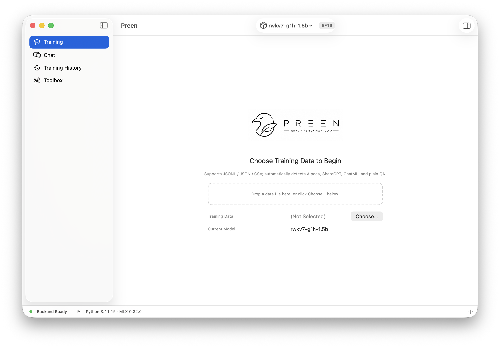
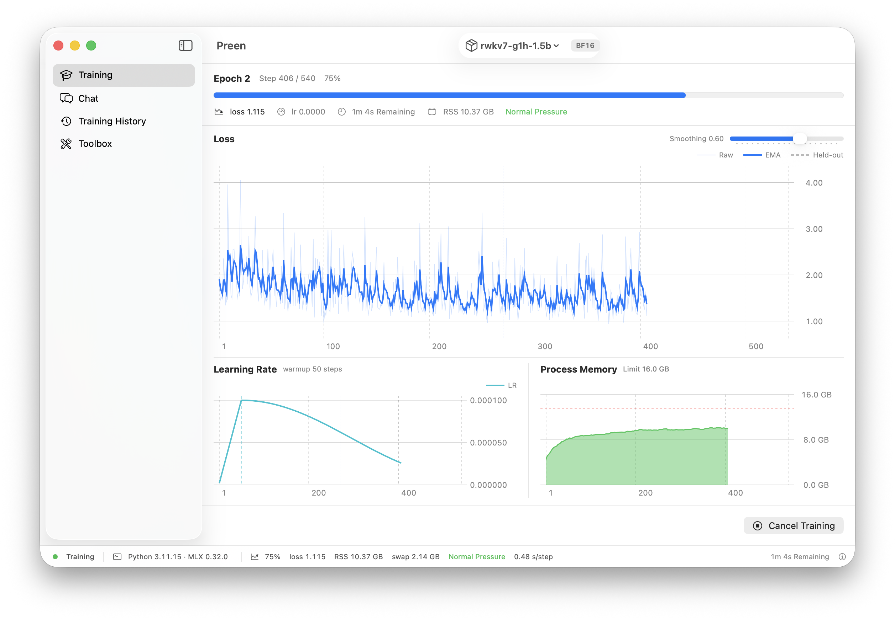

<p align="center">
  
</p>

# Preen — RWKV-7 State Tuning for Mac

**English** · [简体中文](README.zh-CN.md)

<p align="center">
  
  
</p>

> State-tune RWKV-7 on your Mac. A SwiftUI app: drop in a jsonl dataset, pick a
> model, train, and export a mountable state file.
>
> It freezes every weight and trains only the per-layer 64×64 initial state S₀,
> replacing the default zero-initialized state. The rationale is under
> [What this is](#what-this-is).

[v1.0.0](https://github.com/No-22-Github/Preen/releases/latest) is out — see
[Download & install](#download--install).

[](https://github.com/No-22-Github/Preen/actions/workflows/ci.yml)
[](https://github.com/No-22-Github/Preen/actions/workflows/build-app.yml)
[](https://github.com/No-22-Github/Preen/releases/latest)

Under the app is a command-line tool, `statetuner`, driving the same training and
inference engine. Use it for scripting, automation, and troubleshooting.

**Training is fast now.** With the WKV7 Metal checkpoint kernel on by default, a
1.5B model on ~320-token samples runs 540 steps in about **4.5 minutes** (measured:
4 min 23 s, ~10GB memory). The same run takes ~38 minutes on the old differentiable
Python ops loop — roughly **8.5× faster**. See [Why it's fast](#why-training-is-fast).

On a 16GB machine the training-set context can reach 512 tokens; the ceiling above
that hasn't been tested yet.

The app itself is bilingual: full Simplified Chinese and English localization that
follows your system language, structured backend events included.

Measured engineering data and technical decisions live in
[工程实测数据.md](docs/工程实测数据.md).

---

## Download & install

Grab a build from [Releases](https://github.com/No-22-Github/Preen/releases/latest).
Both packages are Apple Silicon only:

| File | Minimum OS | |
|---|---|---|
| `Preen-macos26-arm64.zip` | macOS 26.2+ | pick this by default |
| `Preen-macos14-arm64.zip` | macOS 14.6+ | for older systems |

Feature parity is identical; the only difference is the MLX wheel. The macOS 26
build is meaningfully faster — on the same M5, 1.5B inference prefill is ~95%
faster and training throughput is 5%–17% faster (ctx64/256). If your system is
new enough, don't reach for the 14 build.

The app is unsigned and un-notarized, so Gatekeeper blocks the first launch. After
unzipping, clear the quarantine attribute once, then double-click:

```bash
xattr -dr com.apple.quarantine /path/to/Preen.app
```

The app bundles a complete Python + MLX runtime — no dependencies to install. Just
bring an RWKV-7 model and you're ready. Don't have one? The in-app **Toolbox →
Model conversion** converts BlinkDL / HF weights directly. First launch walks you
through it.

---

## What this is

RWKV-7 is a linear-attention architecture: each layer maintains a matrix-valued
state S that evolves along the sequence. In ordinary inference S starts at zero.
State tuning makes that initial value S₀ a trainable parameter, using gradient
descent to find an initial state equivalent to a "virtual prefix" — it bakes a
long prompt into the model without spending any context.

---

## Why training is fast

RWKV-7's WKV recurrence has two equivalent forward paths on MLX. The native
`mlx-lm` kernel is a fast Metal black box with no VJP — gradients break silently,
so it can't train. Early on, training could only run the differentiable Python
`_wkv7_step_ops` loop: one GPU dispatch per token, so ctx=512 meant 512 dispatches.
That was slow to the point of being infeasible for long sequences (a single 1.5B ×
320-token epoch took ~28 minutes).

Training now defaults to a Metal checkpoint kernel ported from
[rwkv-metal](https://github.com/RafaelUI/rwkv-metal): the whole recurrence runs in
one forward and one backward dispatch, with a VJP registered via
`mx.custom_function`, so S₀'s gradient still flows through the entire recurrence.

On top of the kernel come two more rounds of tuning — the training graph is reused
through `mx.compile`, and the kernel reads bf16 activations directly. Measured end
to end: **1.5B, ~320-token samples, 540 steps in 4 min 23 s** (~0.49 s/step, ~10GB
memory) — versus ~38 minutes on the old ops loop at ~4.2 s/step, about **8.5× faster**.
Longer sequences benefit more: the kernel eliminates more per-token dispatches the
longer the sequence gets. Final-state loss stays within 0.19% of the ops baseline
(numerically equivalent); the full three-round experiment is in
[`docs/decision-fast-wkv7.md`](docs/decision-fast-wkv7.md).

Inference is unchanged: it uses the `mlx-lm` native kernel, which measured ~10%
faster than the upstream inference kernel. `--no-fast-wkv` falls back to the old
ops loop for reproduction.

---

## Architecture & dependencies

Two layers:

```
SwiftUI app   (train / chat / records / toolbox)
      ↕ long-lived inference protocol + one-shot tool-task JSON Lines
Python engine  (mlx-lm training/inference · this repo)
```

Training, inference, and export all live in the Python engine. The app calls it
over IPC; the `statetuner` CLI drives it directly.

The **core engine** is `rwkv7.py` from
[ml-explore/mlx-lm](https://github.com/ml-explore/mlx-lm) (maintained by Apple).
**Backpropagation** is entirely MLX autodiff (`mx.value_and_grad`) — there is no
hand-written backward code anywhere. Whether gradients flow depends only on whether
the forward is differentiable (the checkpoint kernel registers a VJP via
`mx.custom_function`; the ops loop carries a per-step VJP). See
[P0-理论指南.md §二](docs/P0-理论指南.md). This repo's work is the state-tuning
training layer on top — it does not re-implement the RWKV-7 kernel or rewrite
backprop.

### Building the self-contained macOS app

```bash
python3 scripts/build_app.py
```

One run produces `dist/Preen-macos14-arm64.app` (macOS 14.6+) and
`dist/Preen-macos26-arm64.app` (macOS 26.2+), each embedding Apple Silicon CPython
3.11.15 and all runtime dependencies (no model). The two builds' performance
difference is in [Download & install](#download--install) above.

The build machine needs Apple Silicon, Xcode Command Line Tools, `uv`, and network.
The script verifies PBS archive hashes, downloads MLX wheels for the exact platform,
builds both Release variants, runs isolated Python/Metal smoke tests, and does an
ad-hoc signing check — there's no Developer ID signature or notarization, which is
why users need the quarantine step above.

---

## Repository layout

<details>
<summary>Expand tree</summary>

```
src/statetuner/                 training/inference engine + CLI entry point
├── core.py                       patched ops path + trainable state + generate
├── fast_wkv7.py                  WKV7 Metal checkpoint kernel (training fast path)
├── inference.py                  standalone inference engine (sampling / A-B / structured results)
├── data.py                       dataset (jsonl → tokenize + loss mask)
├── templates.py                  format-template single source of truth (QA / INSTRUCTION)
├── chat.py                       interactive session (dynamic state switch / A-B / streaming)
├── thinking.py                   reasoning-dialect think-level handling (inference)
├── inspection.py                 environment / data / state preflight + validation
├── metadata.py                   sidecar metadata alongside training artifacts
├── service.py                    application use-case orchestration (shared by CLI/sidecar)
├── serve.py                      long-lived inference serve protocol
├── events.py                     structured training events (sidecar IPC)
├── model_converter.py            native RWKV-7 .pth → HF safetensors
├── quantizer.py                  offline model quantization
├── tool_events.py                offline tool-task JSON Lines event protocol
├── train.py                      training loop (lr / std monitor / early stop / checkpoint / resume)
├── export.py                     .pth exporter (mountable in RWKV Runner) + round-trip check
├── pth_io.py                     pure-Python torch .pth read/write (no torch; bf16 via ml_dtypes)
└── cli.py                        CLI: train / inference / model conversion / dataset preview + import / checks

tests/                          regression tests (mandatory when touching src)
├── fixtures/                     NekoQA baseline state (nekoqa_04b_s42.npz, product CLI training)
├── golden/                       inference golden snapshots
└── ...                           test modules (incl. --slow training-behavior assertions)

docs/                           documentation
├── 快速上手.md                    step-by-step tutorial — read this first
├── decision-fast-wkv7.md         WKV7 Metal kernel decision record (three-round experiment)
├── RWKV-StateTuner-Roadmap.md    delivery roadmap
├── P0-理论指南.md                 state-tuning theory
├── 工程实测数据.md                 measured engineering data + technical decisions
├── decision-precision.md         precision scheme + memory redline
├── Runner挂载验收.md              Windows RWKV Runner mount steps
└── ...                           conversion / alignment / backward-race reports

scripts/
├── build_app.py                  produces both macOS 14 / 26 self-contained .apps
└── nekoqa_smoke.sh               NekoQA × 1.5B smoke end-to-end script

train_data/NekoQA_10k/          NekoQA dataset (Apache-2.0, see NOTICE.md in-dir)
```

</details>

---

## Command line

For everyday use the app is enough. To script it, or skip the GUI, use the
`statetuner` CLI — the same pipeline the app runs. `uv sync` installs deps (no
torch); `uv run statetuner --help` lists every subcommand.

The full tutorial (parameters, expected loss curves, FAQ) is in
**[docs/快速上手.md](docs/快速上手.md)**; RWKV Runner mount steps for the exported
`.pth` are in the [mount guide](docs/Runner挂载验收.md).

<details>
<summary>Three-step minimal flow: convert → train → preview</summary>

```bash
# 1. Convert: native RWKV .pth → fla HF (zero external downloads; fixture + tokenizer vendored)
uv run statetuner convert-model \
    --rwkv7 models/rwkv7-g1d-0.4b-20260210-ctx8192.pth \
    --out models/converted/rwkv7-g1d-0.4b --precision bf16

# 2. State-tune, then export a mountable .pth right after training
uv run statetuner train \
    --model models/converted/rwkv7-g1d-0.4b \
    --data train_data/NekoQA_10k/nekoqa_smoke_200.json --template qa \
    --out state.npz \
    --lr 0.0001 --epochs 5 --ctx-len 512 --seed 42 \
    --export-pth --pth-out state.pth

# 3. A/B preview: with state vs without — see the style injection directly
uv run statetuner preview \
    --model models/converted/rwkv7-g1d-0.4b --state state.npz \
    --prompt "你好呀，今天想做什么？" --template qa --ab
```

Training defaults to the fast WKV7 Metal kernel (`--fast-wkv`, chunk 16). Add
`--no-fast-wkv` to fall back to the slow differentiable ops loop for reproduction.
`--cache-limit-gb` (shared by train/eval/chat) defaults to `auto` = 25% of physical
memory (~4.3GB on a 16GB machine); lower it to reduce RSS. It applies before the
model loads.

</details>

<details>
<summary>Other commands: chat / eval / export / self-check / tests</summary>

```bash
# Model stays resident; /state switches state on the fly mid-run
# (bare qa template by default; for G1-series reasoning models add
#  --reasoning --think fast to avoid degradation)
uv run statetuner chat \
    --model models/converted/rwkv7-g1d-0.4b --state state.npz \
    --template qa --max-tokens 200 --temperature 0.6 --top-p 0.7
# /state PATH | /state off | /ab on | /config | /help | /quit

# Held-out evaluation
uv run statetuner eval \
    --model models/converted/rwkv7-g1d-0.4b --state state.npz --template qa \
    --data train_data/NekoQA_10k/nekoqa_smoke_200.json --limit 5

# Export npz → pth on its own (or do it in one shot via train --export-pth)
uv run statetuner export --state state.npz --out state.pth

# After cloning, run environment / data / state self-checks first
uv run statetuner doctor
uv run statetuner data-info --model models/converted/rwkv7-g1d-0.4b \
    --data train_data/NekoQA_10k/nekoqa_smoke_200.json --ctx-len 512
uv run statetuner state-info --state state.npz

# Regression tests: fast ~22s / full (with training assertions) ~5min
uv run pytest -q
uv run pytest --slow -q
```

</details>

---

## A few trade-offs

Some choices that may seem counterintuitive: a custom converter that drops fla,
lr starting at 1e-4, a Metal kernel for training, and no torch dependency.

<details>
<summary>Expand</summary>

**Why the converter drops fla and is written from scratch.** The official
`convert_from_rwkv7.py` depends on `flash-linear-attention`, whose top-level import
pulls in `fla.ops` and then triton — and triton has no macOS wheel, so that path is
a dead end on Mac. So the key-name mapping is implemented directly, with the check
fixture (generated from 0.1B safetensors) and a vendored World tokenizer bundled in
the repo. The whole conversion is zero external downloads. See
[转换器零依赖化报告.md](docs/转换器零依赖化报告.md).

**Why lr starts at 1e-4, not the 1.0 that RWKV-PEFT uses.** In practice lr=1.0 blows
the state up numerically — std spikes to 50–100× normal and the state degenerates
into an unconditional bias. The product default is a peak lr of 0.0001 with cosine
decay to 0.00001 (lr_floor), letting the state grow gently while keeping its
conditional response to input.

**Why training moved to the Metal checkpoint kernel.** One dispatch for the whole
recurrence instead of one per token, with a VJP via `mx.custom_function` so S₀'s
gradient still flows. Details in [Why training is fast](#why-training-is-fast).

**Why no torch.** RWKV's `.pth` is stored by torch with zip+pickle. The only place
the whole project needs torch is reading the raw weights and writing the exported
state. Carrying 480MB of torch for those two I/O points isn't worth it, and it sits
awkwardly against MLX-native positioning. So `pth_io.py` re-implements the format in
pure Python: the read side is byte-for-byte equal to `torch.load` (798/798 tensors
verified across 3 real models), and the write side produces artifacts RWKV Runner
mounts directly, byte-identical to the torch version. bf16 is filled in via
`ml_dtypes` (3.8MB), covering the type numpy lacks.

</details>

---

## Acknowledgements

This list matches the credits wall in the app's "About Preen":

| Project | License | Role |
|---|---|---|
| [MLX](https://github.com/ml-explore/mlx) | MIT | Apple ML framework — tensor ops and autodiff |
| [MLX-LM](https://github.com/ml-explore/mlx-lm) | MIT | Core training/inference engine, provides the `rwkv7.py` forward |
| [Flash Linear Attention](https://github.com/fla-org/flash-linear-attention) | MIT | Upstream linear-attention library, model-conversion check baseline |
| [RWKV-PEFT](https://github.com/Joluck/RWKV-PEFT) | Apache-2.0 | Reference for RWKV parameter-efficient fine-tuning |
| [rwkv-metal](https://github.com/RafaelUI/rwkv-metal) | Apache-2.0 | Training speedup: source of the WKV7 Metal checkpoint kernel port |
| [RWKV-LM](https://github.com/BlinkDL/RWKV-LM) | Apache-2.0 | BlinkDL's RWKV model repo, reference implementation |
| [BlinkDL/rwkv7-g1](https://huggingface.co/BlinkDL/rwkv7-g1) | Apache-2.0 | Official RWKV-7 G1 weights — the actual download/convert source |
| [RWKV Runner](https://github.com/josStorer/RWKV-Runner) | MIT | Mount target for exported `.pth`, direct link into the RWKV ecosystem |
| [NekoQA-10K](https://huggingface.co/datasets/liumindmind/NekoQA-10K) | Apache-2.0 | Cat-girl-style QA dataset, style-transfer training data |
| [rwkv7-0.1B-g1](https://huggingface.co/fla-hub/rwkv7-0.1B-g1) | Apache-2.0 | Source of the World Tokenizer and conversion check template |
| [Transformers](https://github.com/huggingface/transformers) | Apache-2.0 | HF-format baseline for the conversion chain |
| [safetensors](https://github.com/huggingface/safetensors) | Apache-2.0 | Tensor format for conversion output (`.pth` → HF safetensors) |
| [swift-markdown-ui](https://github.com/gonzalezreal/swift-markdown-ui) | MIT | In-app Markdown rendering |
| [uv](https://docs.astral.sh/uv/) | Apache-2.0 | Build toolchain and dependency management |

License information is authoritative in each project's own repo.

The core engine is Apple's mlx-lm. This project is the state-tuning training layer
and the surrounding toolchain — it does not re-implement the RWKV-7 kernel or
rewrite backpropagation.

---

## License

Released under the [Apache License 2.0](LICENSE).

```
Copyright 2026 No-22-Github (https://github.com/No-22-Github/Preen)
```

Dependencies and referenced projects are licensed by their own upstreams: mlx-lm
(MIT), flash-linear-attention (MIT), the NekoQA-10K dataset (Apache-2.0, see
`train_data/NekoQA_10k/NOTICE.md`).

